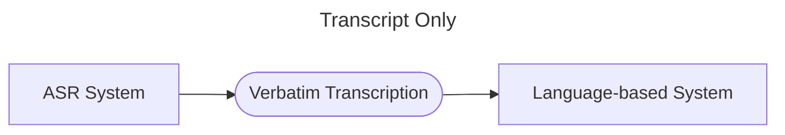

## Notes

- Compares the following systems and found out that the fusion-based model can best detected the disfluency:

    - Modern ASR is not built for this purpose, so the transcripts themselves are the bottleneck

    - Better than the transcript-only pipeline
    - Underperforms for revisions/restarts, which need more semantic context than an acoustic-only model captures
![[99 Assets/Media/image 18.png]]

## Reading Summary

**Abstract**

Speech disfluencies (filled pauses, repetitions, revisions, restarts, partial words) disrupt the typical flow of speech and can reflect cognitive load or, in stuttering, a clinical disorder. The authors <u>investigate language-, acoustic-, and multimodal methods for frame-level automatic detection and categorization of disfluency in audio. </u>They first benchmark several ASR systems on their ability to transcribe disfluencies (verbatim transcription), then feed those transcripts into a language-based detector, then test an acoustic-only approach that skips transcription entirely, and finally present multimodal fusion architectures. They find that detection performance using ASR transcripts is limited primarily by transcript/alignment quality, that acoustic-only detection outperforms the ASR-language pipeline, and that multimodal fusion further improves over either unimodal approach.

**Research Question**

How do different ASR systems perform at transcribing disfluent (verbatim) speech; how does using their transcripts affect downstream frame-level disfluency detection/categorization compared to manual transcripts; can disfluencies be detected directly from the acoustic signal without an intermediate transcription step; and does fusing acoustic and ASR-derived language representations outperform either modality alone?

**Methodology**

Using the <u>Switchboard telephone-conversation corpus </u>(with MSU transcript corrections and Zayats et al.'s disfluency labels), the authors define `five frame-level disfluency classes` — filled `pause`, `partial word`, `repetition`, `revision`, `restart` — with standard train/dev/test conversation-ID splits. They compare ASR systems (W2V2, HuBERT, WavLM-FT, Whisper-FT, Azure-OTS) on verbatim transcription quality (word/frame error rate, split by disfluent vs. non-disfluent tokens), then feed each system's transcripts into a fine-tuned BERT disfluency detector, benchmarked against a model trained on manual transcripts. Separately, acoustic-only models fine-tune W2V2/HuBERT/WavLM directly on frame-level labels, bypassing transcription. Finally, three fusion architectures (single-layer perceptron, BLSTM, transformer) combine fine-tuned WavLM acoustic representations with fine-tuned BERT-on-Whisper-FT language representations (upsampled to frame level via ASR timestamps), trained with 3 random seeds and evaluated by F1 and unweighted average recall.

**Findings**

With manual transcripts, BERT detects most disfluency classes well (filled-pause recall 1.00, repetitions/partial words 0.88) but struggles with classes needing more context (revisions 0.68, restarts 0.09, the rarest class). Substituting ASR transcripts causes large drops, showing detection is bottlenecked by transcription/alignment quality rather than the detector itself. Acoustic-only detection (WavLM, no transcription step) beats the best ASR-language pipeline for filled pauses and partial words, matches it for repetitions, but underperforms for revisions/restarts, which need more semantic context than an acoustic-only model captures. Multimodal fusion of acoustic and language representations improves over both unimodal approaches, with a BLSTM fusion network performing best overall — evidently because it can exploit local sequential context from both modalities around each frame.

**Results**

Manual-transcript BERT unweighted recall = 0.71, versus 0.26 (WavLM-FT ASR transcripts), 0.44 (Whisper-FT), 0.40 (Azure-OTS). Acoustic-only WavLM reaches unweighted F1 = 0.45 (vs. 0.35 for the best ASR-language pipeline). The BLSTM multimodal fusion model reaches unweighted F1 = 0.52 / weighted F1 = 0.69 — the best of all approaches tested — with class-level gains such as repetition F1 rising from 0.48 (language) / 0.64 (acoustic) to 0.69 (fusion), and partial-word F1 rising from 0.17 / 0.32 to 0.40. The fusion model correctly categorized 77% of all truly disfluent frames overall.

**Conclusion**

Because current ASR systems aren't built to preserve disfluencies, transcription is the main bottleneck for scalable language-based disfluency detection. Acoustic-only models sidestep this bottleneck and already rival or beat ASR-language pipelines, and multimodal fusion of acoustic and (ASR-derived) language representations gives the best overall performance, especially for classes needing contextual disambiguation — a direct methodological precedent for detecting discourse-planning difficulty multimodally without requiring costly manual transcription.

*Sources: *[*arXiv abstract*](https://arxiv.org/abs/2311.00867)*, *[*arXiv PDF*](https://arxiv.org/pdf/2311.00867)*, *[*IEEE/ACM TASLP (published version)*](https://dl.acm.org/doi/10.1109/TASLP.2024.3485465)