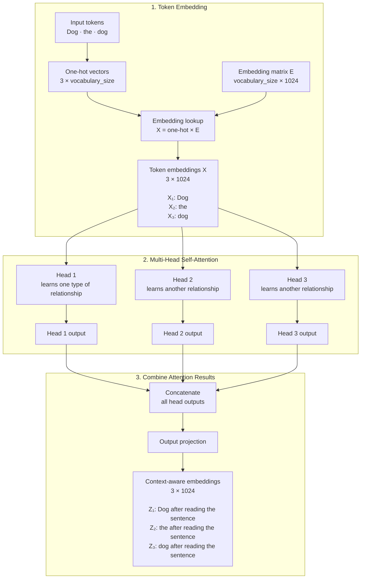

> Source: [Transformers in Practice](https://www.deeplearning.ai/courses/transformers-in-practice/) — [DeepLearning.AI](http://deeplearning.ai/) × AMD, 3h11m, 3 modules. This doc reconstructs and deepens each module: behavior → internals → production.

# Module 1 — Observed behavior: the autoregressive loop

Everything an LLM does is one loop: feed the context, get a distribution over the vocabulary, pick ONE token, append it, repeat. The model is a function

$p_\theta(x_{t+1} \mid x_1, \dots, x_t) = \mathrm{softmax}\left(\frac{W_U h_t}{T}\right)$

where $h_t \in \mathbb{R}^{d}$ is the final-layer hidden state at position $t$, $W_U \in \mathbb{R}^{|V| \times d}$ the unembedding matrix, and $T$ the temperature. **Why this explains behavior**: the model never plans a full sentence; hallucinations are just locally-plausible continuations, and every "reasoning" technique is a way of shaping the context that conditions this loop.

## Token sampling

- **Greedy**: $x_{t+1} = \arg\max_i p_i$ — deterministic, degenerates into repetition loops.
- **Temperature**: divide logits by $T$; $T \to 0$ sharpens (approaches greedy), $T > 1$ flattens. Because softmax is $p_i \propto e^{z_i/T}$, temperature rescales log-probability *differences*, not probabilities directly.
- **Top-k**: keep the $k$ highest logits, renormalize.
- **Top-p (nucleus)**: keep the smallest set $S$ with $\sum_{i \in S} p_i \ge p$ — adapts the cutoff to the distribution's entropy (k is fixed; the nucleus isn't). When the model is confident (one token dominates), the nucleus shrinks to almost just that token; when it's uncertain (flat distribution over many plausible continuations), the nucleus widens automatically — this entropy-adaptiveness is exactly what a fixed top-k cannot do.
- **Min-p**: keep tokens with probability at least $p_{\text{min}} \cdot p_{\text{max}}$ (a fraction of the top token's probability, rather than an absolute mass threshold like top-p). This scales the cutoff with model confidence more directly and tends to behave better than top-p at high temperature, where top-p's cumulative-mass threshold can admit a long tail of low-quality tokens.
- **Repetition / frequency penalty**: subtract a penalty from the logits of tokens already seen in the context (proportional to count, for frequency penalty), directly countering the greedy-decoding degenerate-repetition failure mode described above by making previously-used tokens artificially less attractive.

```python
def sample(logits, T=1.0, top_k=0, top_p=1.0):
    logits = logits / T
    if top_k > 0:
        kth = torch.topk(logits, top_k).values[..., -1, None]
        logits[logits < kth] = -float('inf')
    if top_p < 1.0:
        sl, idx = logits.sort(descending=True)
        cum = sl.softmax(-1).cumsum(-1)
        mask = cum - sl.softmax(-1) > top_p      # keep first token past threshold
        logits[idx[mask]] = -float('inf')
    return torch.multinomial(logits.softmax(-1), 1)
```

## Structured outputs (constrained generation)

A finite-state machine over the output grammar (e.g., JSON schema) masks illegal tokens **before** sampling: set $z_i = -\infty$ for every token that cannot extend a valid string from the current FSM state. Generation stays on-grammar by construction — this is how `outlines` / `guidance` / OpenAI structured outputs work. Cost: the FSM must be compiled against the tokenizer's vocabulary (a token can cross grammar-symbol boundaries — that's the hard part).

## Grounding (RAG) and reasoning (CoT) are the same trick

Both inject tokens into the context so the *conditional* distribution changes: RAG puts retrieved evidence before the question (the answer becomes copy-heavy, attention shifts to the evidence); chain-of-thought makes the model emit intermediate tokens so later predictions condition on its own partial work. Neither changes the weights — they change $x_{1:t}$, i.e. both are pure *inference-time* interventions on the input to the same fixed function $p_\theta$.

**Why CoT helps mechanically, not just "the model thinks more":** every token the model emits gets appended to the context and conditioned on for every subsequent prediction (Module 1's autoregressive loop). Forcing the model to emit "Step 1: ... Step 2: ..." before the final answer means the final-answer token's prediction is now conditioned on those intermediate tokens sitting in context — effectively giving the model extra forward-pass compute and extra working memory (via the residual stream re-reading its own outputs) that a direct question→answer prompt never allocates. This is also why CoT gains are largest on tasks requiring multi-step composition and smallest on tasks answerable in a single lookup.

**Why RAG reduces (but doesn't eliminate) hallucination:** recall Module 1's core claim — the model never plans, it just continues locally-plausible text. Without retrieved evidence, "locally plausible" is only anchored by the model's training-time-compressed world knowledge, which is lossy and can confabulate smoothly. With retrieved passages in context, "locally plausible continuation" now includes *copying or paraphrasing nearby evidence tokens*, which attention heads are very good at (this is largely the same induction-head machinery from Module 2) — so the easiest, most probable continuation becomes grounded rather than confabulated. RAG doesn't stop the model from hallucinating; it just changes what "the path of least resistance" token sequence looks like.

# Module 2 — Internals: attention, positions, layers

![[99 Assets/Media/ModalNet-21.png|The Transformer model architecture — encoder stack (left) and decoder stack (right), showing multi-head attention, add & norm residual connections, and position-wise feed-forward blocks.]]

*Figure: The original Transformer architecture (Vaswani et al., 2017). Modern decoder-only LLMs (GPT, Llama, etc.) retain only the right-hand decoder stack, drop the cross-attention sublayer (since there's no separate encoder), and keep masked self-attention and FFN blocks repeated N times.*

## Attention



Attention answers: *for token* $t$*, which other positions' information should I pull into my representation right now?* Each head linearly projects the sequence $X \in \mathbb{R}^{n \times d}$ into three learned subspaces:

- queries ("what am I looking for")
- keys ("what do I contain, for matching")
- values ("what do I actually broadcast if matched"):

$Q = XW_Q,\quad K = XW_K,\quad V = XW_V$

where $W_Q, W_K \in \mathbb{R}^{d \times d_k}$ and $W_V \in \mathbb{R}^{d \times d_v}$. The **compatibility** between query $i$ and key $j$ is their dot product $q_i \cdot k_j$ — large when the two vectors point in a similar direction in the learned subspace. Turning compatibilities into a weighted average of values:

![[99 Assets/Media/image 4.png]]

![[99 Assets/Media/image 5.png]]

![[99 Assets/Media/image 6.png]]

$\mathrm{Attn}(Q,K,V) = \mathrm{softmax}\!\left(\frac{QK^\top}{\sqrt{d_k}} + M\right)V$

with causal mask $M_{ij} = -\infty$ for $j > i$ (a token cannot attend to the future — this is what makes the model autoregressive rather than bidirectional). **Why **$\sqrt{d_k}$: if $q,k$ have unit-variance i.i.d. entries, $q^\top k$ has variance $d_k$; dividing keeps logits $\mathcal{O}(1)$ so softmax doesn't saturate and gradients don't vanish.

> Details in:
> [[Scaled Dot-Product Attention Why Divide by √dₖ]]

$$
\underbrace{\text{Input Embedding}}_{vocab\_size \times 1024} \rightarrow \begin{cases} 
	Q = W_Q (1024 \times 64)\\ 
	K = W_K (1024 \times 64)\\ 
	V = W_V (1024 \times 64)
\end{cases} \\
\rightarrow
S = \frac{Q \cdot K^T}{\sqrt{d_k}} + M
\rightarrow 
A = softmax(S) \cdot V
$$

![[99 Assets/Media/image 8.png]]

**Why multiple heads, not one big one:** a single attention operation computes exactly one notion of "relevance" per query — one weighted average. Real language needs many simultaneous relations (subject↔verb agreement, coreference, syntax, copy patterns) that live in different subspaces of the same hidden state. Multi-head attention runs $h$ independent, smaller attention operations in parallel and concatenates them:

$\mathrm{MultiHead}(X) = \mathrm{Concat}(\mathrm{head}_1, \ldots, \mathrm{head}_h)W_O \\ \mathrm{head}_i = \mathrm{Attn}(XW_Q^i, XW_K^i, XW_V^i)$

with $d_k = d_v = d/h$ so the total compute is comparable to one full-size head — you trade one 512-dim relevance computation for eight 64-dim ones, each free to specialize. $W_O \in \mathbb{R}^{d \times d}$ then mixes the heads' outputs back together so downstream layers see a single $d$-dimensional vector per position.

```python
import torch, torch.nn.functional as F

def multi_head_attention(x, Wq, Wk, Wv, Wo, n_heads, causal=True):
    # x: (B, T, d).  Wq,Wk,Wv,Wo: (d, d)
    B, T, d = x.shape
    dh = d // n_heads
    def split(W):
        h = x @ W                          # (B, T, d)
        return h.view(B, T, n_heads, dh).transpose(1, 2)  # (B, nh, T, dh)
    q, k, v = split(Wq), split(Wk), split(Wv)
    scores = (q @ k.transpose(-2, -1)) / dh**0.5           # (B, nh, T, T)
    if causal:
        mask = torch.triu(torch.ones(T, T, dtype=torch.bool), diagonal=1)
        scores = scores.masked_fill(mask, float('-inf'))
    attn = F.softmax(scores, dim=-1)
    out = attn @ v                                          # (B, nh, T, dh)
    out = out.transpose(1, 2).contiguous().view(B, T, d)     # concat heads
    return out @ Wo
```

Interpretable heads exist (induction heads that copy `[A][B]...[A] → [B]`, previous-token heads, syntactic heads) — the course's visualizations are essentially mini mechanistic interpretability. Induction heads specifically implement a 2-step circuit across two layers: a **previous-token head** in an early layer writes "the token before me was X" into the residual stream, and a later **induction head** queries "where else did X appear, and what came right after it" — this pattern is widely believed to be the mechanistic basis of in-context learning and few-shot prompting.

## Positional encoding

Attention (the $QK^\top$ dot product, then softmax, then weighted sum of $V$) is **permutation-invariant**: shuffle the input tokens and shuffle the output the same way — nothing in the formula reads off a token's position. So order must be injected explicitly, or "the cat sat on the mat" and "the mat sat on the cat" would look identical to attention.

**Classic approach — absolute position embeddings.** Add a learned or fixed vector $p_t$ to the token embedding at position $t$: $x_t = e_t + p_t$. Sinusoidal encodings use $p_{t,2i} = \sin(t/10000^{2i/d})$, $p_{t,2i+1}=\cos(t/10000^{2i/d})$ — chosen so that $p_{t+k}$ is a *linear function* of $p_t$ (via angle-sum identities), giving the model a cheap way to represent relative offsets even though the encoding is injected as an absolute signal. The drawback: the network must *learn* to recover relative structure from this absolute signal, and generalization to sequence lengths longer than seen in training is poor.

**Modern approach — RoPE (Rotary Position Embedding).** 

![[99 Assets/Media/image 9.png]]

Instead of adding a position vector, RoPE *rotates* the query and key vectors by an angle proportional to their position. Split each $d_k$-dim query/key vector into $d_k/2$ pairs of coordinates; for the pair at index $i$ and position $m$, apply the 2D rotation matrix

$R_{m,i} = \begin{pmatrix}\cos(m\theta_i) & -\sin(m\theta_i)\\ \sin(m\theta_i) & \cos(m\theta_i)\end{pmatrix}, \qquad \theta_i = 10000^{-2i/d_k}$

so the full rotation applied to vector $q$ at position $m$ is $R_m q$ (block-diagonal composition of all pairwise 2D rotations). **Why rotation specifically:** rotation matrices compose by simple angle addition, $R_m^\top R_n = R_{n-m}$, which means the attention score between a rotated query at position $m$ and rotated key at position $n$ depends *only on their offset* $n-m$, never on their absolute positions:

$\langle R_m q, R_n k \rangle = q^\top R_m^\top R_n k = q^\top R_{n-m}k = \langle q, R_{n-m} k \rangle$

This gives RoPE **relative** position awareness for free, injected multiplicatively into $Q$ and $K$ rather than additively into the embeddings — and because rotation preserves vector norm, it doesn't distort the magnitude information attention relies on. Using different rotation frequencies $\theta_i$ per dimension pair (geometrically spaced, like the sinusoidal encoding) means low-index pairs rotate fast (sensitive to short-range position) and high-index pairs rotate slowly (sensitive to long-range position) — a multi-resolution position code baked into a single rotation.

```python
import torch

def rope_rotate(x, base=10000.0):
    # x: (..., T, d) — apply RoPE independently to each of d/2 coordinate pairs
    T, d = x.shape[-2], x.shape[-1]
    theta = base ** (-torch.arange(0, d, 2).float() / d)      # (d/2,)
    pos = torch.arange(T).float()                               # (T,)
    angles = torch.outer(pos, theta)                             # (T, d/2)
    cos, sin = angles.cos(), angles.sin()
    x1, x2 = x[..., 0::2], x[..., 1::2]                          # even/odd dims
    x_rot_even = x1 * cos - x2 * sin
    x_rot_odd  = x1 * sin + x2 * cos
    out = torch.stack([x_rot_even, x_rot_odd], dim=-1).flatten(-2)
    return out
```

This relative-offset property is exactly why context-length extension tricks (position interpolation, NTK-aware scaling, YaRN) work by *rescaling the RoPE frequencies* $\theta_i$ rather than retraining the whole model — they stretch the rotation schedule so a model trained on 4k positions can be coaxed into producing sensible relative-offset behavior at 32k+ positions.

> **NOTE**:
There is also another encoding called NoPE (No positional encoding). It claims that the positional information. has been given with the causal matrix

## Layers and the residual stream

A block is $x \leftarrow x + \mathrm{Attn}(\mathrm{LN}(x))$, then $x \leftarrow x + \mathrm{MLP}(\mathrm{LN}(x))$. Think of the residual stream as a shared memory that each layer reads from and writes small updates into. **Logit lens** (the course's "decoding intermediate layers" lab): apply the unembedding $W_U$ to intermediate $h^{(\ell)}_t$ — predictions sharpen gradually across depth, showing layers as iterative refinement, not a single computation at the end.

### Decoding

![[99 Assets/Media/image 10.png]]

1. Take the last token embedding from the hidden layer
2. Put it into the **Unembedding Matrix ( **$W_U = W_{E^T}$** )**
3. Generate the logits for the vocab
4. Apply softmax and the sampling method to decide the final output word

![[99 Assets/Media/image 11.png]]

# Module 3 — Scaling & deploying on GPUs

### Model Parameters to Memory Usage

$$
GB = \frac{P \times Q}{8} \times 1.2
$$

- $P$**: P billion of parameters**
- $Q$**: precision**
    - FP32 (single precision)
        - High dynamic range and exact accuracy, but demands the highest memory footprint and compute time
    - FP16 (half precision)
        - Half the memory of FP32, limited numerical range
    - BF16(brain floating point)
        - The same exponent range as FP32 while eliminating the need for gradient scaling during mixed-precision training 
    - FP8(8-bit floating point)

### GPU Architecture

![[99 Assets/Media/image 12.png]]

Inference is **memory-bandwidth-bound**, not compute-bound: generating one token requires streaming all weights through the SMs for a single matvec per matrix. Arithmetic intensity ≈ 2 FLOPs/parameter-byte — far below GPU roofline. Every optimization below attacks memory traffic.

### **Quantization**:

- Reduce the model size, allowing it to be put into memory 
- store weights in INT8/FP8/FP4 with per-channel scales, $w \approx s \cdot q$, $s = \max|w| / q_{max}$, $q = \mathrm{round}(w/s)$ clipped to $[-q_{max}, q_{max}]$. Halving bytes ≈ halves token latency (bandwidth-bound, so bytes moved is what matters, not FLOPs). Quality risk concentrates in **outlier channels**: a handful of weight/activation dimensions have magnitudes 10–100× the rest, and a single shared scale $s$ either clips those outliers (destroying them) or wastes most of the quantization range protecting them (blowing up error on everything else).

![[99 Assets/Media/x1 2.png|AWQ: activation-aware weight quantization. Weights are grouped by column; a small number of "salient" weight channels (identified by looking at activation magnitudes, not weight magnitudes) are protected by a per-channel scaling factor before quantizing the rest at low bit-width.]]

*Figure: AWQ (Lin et al., 2023) — rather than solving this per-channel outlier problem with mixed precision (slow, hardware-unfriendly), AWQ multiplies salient weight channels by a scale *$>1$* before quantizing (making them relatively larger and thus lower quantization error) and divides the corresponding activations by the same scale post-hoc, so the product *$w \cdot x$* is mathematically unchanged — a free way to protect what matters without touching the hardware-friendly uniform quantization kernel.* SmoothQuant instead migrates quantization difficulty from activations (hard to quantize — outliers) to weights (easy — smooth distribution) via a per-channel factor $x' = x/\mathrm{diag}(\alpha)$, $w' = w \cdot \mathrm{diag}(\alpha)$, again leaving $w \cdot x = w' \cdot x'$ exactly unchanged. **Why it matters / connections:** this outlier-preserving-scale trick is the same core idea used in QLoRA's NF4 format and in per-channel calibration for LoRA-adapter quantization — see [🧩 LLM Finetuning Deep Dive — Full Fine-tuning, LoRA & QLoRA](https://app.notion.com/p/391e445b30a481cf8c5fc6f2f14d4d58) for the training-time version of this problem, including the exact NF4 quantile-quantization math.

### **KV cache**:

- Reduce the redundant computation of scaling dot product
- without caching, generating token $t$ recomputes $K,V$ for every position $1..t$ from scratch — $\mathcal{O}(t)$ work per token, $\mathcal{O}(t^2)$ total over a sequence. Since $K,V$ for already-generated tokens never change (causal masking means position $j$'s key/value don't depend on anything after it), we cache them and append one new column per step: per-token cost drops to $\mathcal{O}(t)$ *memory reads*, $\mathcal{O}(1)$ new compute. Memory: $2 \cdot L \cdot n_{kv} \cdot d_{head} \cdot t \cdot \text{bytes}$ (the 2 is for K and V, $L$ = layers, $n_{kv}$ = number of KV heads) — for long contexts the cache dwarfs the weights, which is why **GQA** (grouped-query attention, fewer KV heads shared across query heads) and paged attention (vLLM) exist. GQA sets $n_{kv} < n_{heads}$: e.g. 8 query heads sharing 2 KV heads (4 queries per KV head) shrinks the cache by 4× with minimal quality loss, since the memory-bandwidth bottleneck comes specifically from loading $K,V$, not $Q$.

<!-- Column 1 -->
![[99 Assets/Media/image 13.png]]

<!-- Column 2 -->
![[99 Assets/Media/image 14.png]]

![[99 Assets/Media/image 15.png]]

```python
import torch

class KVCache:
    def __init__(self, n_layers, n_kv_heads, d_head, max_len, dtype=torch.bfloat16):
        shape = (n_layers, 2, max_len, n_kv_heads, d_head)  # 2 = K,V
        self.cache = torch.zeros(shape, dtype=dtype)
        self.pos = 0
    def append(self, layer_idx, k, v):  # k,v: (n_kv_heads, d_head) for ONE new token
        self.cache[layer_idx, 0, self.pos] = k
        self.cache[layer_idx, 1, self.pos] = v
    def get(self, layer_idx):
        return self.cache[layer_idx, 0, :self.pos+1], self.cache[layer_idx, 1, :self.pos+1]
```

### **Flash attention**: 

- Reduce moving the results of scaled dot product $S =\frac{QK^T}{\sqrt{d_k}}$ and  attention $A = sigmoid(S)$ back and forth between vram and compute units
- Allows you to gain memory bandwidth and VRAM as you don’t store S and A into VRAM
- Naive approach
    - the naive attention formula computes the full $t \times t$ score matrix $QK^\top$, writes it to slow HBM, reads it back for softmax, writes the softmax output back, reads it again for the $\times V$ multiply — for long sequences this HBM traffic (not the matmul FLOPs) is the real bottleneck. FlashAttention never materializes that full matrix at all.

![[99 Assets/Media/x1 3.png|FlashAttention: outer loop over blocks of K,V loaded into fast SRAM, inner loop over blocks of Q, with output written back to HBM after online-softmax rescaling — avoiding ever materializing the full N×N attention matrix.]]

*Figure: FlashAttention (Dao et al., 2022) tiling and IO pattern (left), and wall-clock speedup vs. a standard PyTorch attention implementation on GPT-2 (right).*

5. It tiles $Q,K,V$ into blocks small enough to fit in on-chip SRAM
6. processes the score matrix block-by-block instead of all at once. 
- The catch: softmax needs a *global* normalizer over the whole row, but you're only looking at one block of the row at a time. The fix is **online softmax** — maintain a running max $m$ and running sum $\ell$ per query row, and every time a new block arrives, rescale the previous partial output by a correction factor before adding the new block's contribution:

$m^{\text{new}} = \max(m^{\text{old}}, \tilde m), \quad \ell^{\text{new}} = e^{m^{\text{old}}-m^{\text{new}}}\ell^{\text{old}} + e^{\tilde m - m^{\text{new}}}\tilde \ell$

*Why this is mathematically exact, not an approximation:* softmax's max-subtraction trick ($e^{z_i}/\sum_j e^{z_j} = e^{z_i - m}/\sum_j e^{z_j-m}$ for any constant $m$, used purely for numerical stability) still holds if you revise your estimate of $m$ as you see more blocks, *as long as you retroactively rescale everything computed so far* by $e^{m^{\text{old}}-m^{\text{new}}}$. This lets FlashAttention compute the identical output to standard attention while only ever holding one block of the score matrix in fast memory. IO cost drops from $\mathcal{O}(t^2)$ HBM reads to $\mathcal{O}(t^2 d / M)$ where $M$ = SRAM size — a purely systems-level optimization with zero change to the math.

### Attention vs. Flash Attention

![[99 Assets/Media/Screen_Recording_2026-07-05_at_21.06.23.mov]]

![[99 Assets/Media/flash_attention.mp4]]

### **Speculative decoding**: 

- normally, generating $\gamma$ tokens autoregressively requires $\gamma$ sequential, memory-bandwidth-bound forward passes through the full (large) model. Speculative decoding instead lets a small, cheap **draft** model propose $\gamma$ tokens speculatively, then verifies ALL of them with a single parallel forward pass of the big **target** model (scoring $\gamma$ positions at once is roughly as expensive, in wall-clock terms, as scoring one — it's the same memory-bandwidth-bound weight load either way).

![[99 Assets/Media/figure1.png|Speculative decoding: a small draft model proposes several tokens autoregressively; the large target model then scores all proposed positions in one parallel forward pass and accepts/rejects each via rejection sampling.]]

*Figure: Leviathan et al. (2023) — draft tokens (top) proposed sequentially by a small model, verified in parallel by the large model (bottom), with rejected tokens (red) replaced by a fresh sample from a corrected distribution.*

Each proposed token $x$ is accepted with probability $\min\!\left(1, \dfrac{p_{\text{target}}(x)}{p_{\text{draft}}(x)}\right)$; if rejected, a replacement token is sampled from the *residual* distribution $\max(0,\, p_{\text{target}} - p_{\text{draft}})$, renormalized. **Why this exactly preserves the target distribution (not an approximation):** this is textbook rejection sampling — accepting proposals from an easy-to-sample proposal distribution $p_{\text{draft}}$ with probability proportional to the density ratio, and patching the reject case with the leftover probability mass, is guaranteed to produce samples distributed exactly as $p_{\text{target}}$, regardless of how good or bad the draft model is (a bad draft model just means more rejections, i.e. less speedup, never incorrect output). Speedup ≈ acceptance-rate-dependent, typically 2–3× when the draft agrees often; the theoretical expected number of tokens generated per big-model call is $\frac{1-\alpha^{\gamma+1}}{1-\alpha}$ where $\alpha$ is the (task-dependent) average acceptance probability.

- **Production issues**: batching vs latency (in-flight/continuous batching), prefill vs decode phases having opposite bottlenecks, OOM from KV growth, non-determinism from batched kernels.

# Cross-check questions

7. Why does temperature change *relative* preferences among likely tokens more than raising top-p does?
8. Derive the KV-cache memory for Llama-3-8B (L=32, n_kv=8, d_head=128, bf16) at 32k context. (≈ 4 GiB/sequence.)
9. Why is speculative decoding lossless while quantization is not?

# Module 2 — Additional Reading

> Reference notes extending the internals above with primary-source math and mechanics. Organized by the course's Module 2 reading list; each subsection assumes the attention/positional-encoding/residual-stream treatment already covered and adds what the primary sources contribute on top.

## 1. Attention & the Transformer — primary sources

The `MultiheadAttention` exercise (Module 2 above) is a direct implementation of [Vaswani et al., 2017](https://arxiv.org/abs/1706.03762) §3.2. Three companion framings worth having alongside the formulas:

- **Illustrated Transformer** (Jay Alammar): the Q/K/V "lookup" analogy — a query is *what I'm searching for*, a key is *the label on what I have*, a value is *what I hand over if the label matches*. Useful for building intuition before the linear-algebra treatment; also has the clearest diagrams of how the encoder/decoder stacks differ (cross-attention sublayer) from the decoder-only architecture this doc otherwise focuses on.
- **Karpathy, "Let's build GPT"**: frames a transformer block as "communication, then computation" — attention lets tokens *communicate* (gather information from other positions), the MLP lets each token *compute* on what it gathered, alone, with no cross-token mixing. This "communication vs. computation" split is a clean way to remember why attention is the only place information moves across positions, and everything else (MLP, LayerNorm) acts position-wise.
- Both sources build the causal mask and multi-head split from scratch in code, which is good cross-validation against the `multi_head_attention` reference implementation above — line up your tensor shapes at each step against theirs if a shape bug appears in the exercise.

## 2. PyTorch tensor mechanics — the machinery behind Exercises 1–3

A tensor is a view over a flat 1D storage buffer described by `shape` and `stride` (`stride[d]` = how many storage elements to skip to advance one step along dim `d`). Every operation below is really just a statement about how `shape`/`stride` change, not about data movement:

- `**.view(*shape)**`: reinterprets the *same* storage with a new shape — zero copy. It only succeeds if the requested shape is expressible with the tensor's current strides; PyTorch refuses to guess a remapping otherwise (`RuntimeError: view size is not compatible...`).
- `**.transpose(d0, d1)**`: swaps two strides — also zero copy — but the result is generally **non-contiguous** (its stride order no longer matches a standard row-major layout).
- `**.contiguous()**`: if strides aren't in canonical (row-major) order, allocates a new buffer and copies data into it so strides become canonical again. This is why the reference implementation calls `.transpose(1, 2).contiguous().view(B, T, d)` to merge heads back together after attention — `.view` would raise on the non-contiguous output of `.transpose` without the copy `.contiguous()` performs first.
- `**.reshape(*shape)**`** vs **`**.view**`: `reshape` tries a zero-copy view first and *silently falls back to a copy* if that's not possible — always succeeds, at the cost of an occasional hidden copy. `view` never copies; it errors instead, which is useful when a silent copy would mask a bug you'd rather catch.
- **Broadcasting**: shapes are aligned right-to-left; a dimension of size 1 (or a missing leading dimension) is virtually expanded to match, with no data copy. This is exactly the mechanism that lets the causal mask of shape `(T, T)` combine with attention scores of shape `(B, h, T, T)`, and lets `masked_fill(mask, -inf)` apply a 2D boolean mask across the batch and head dimensions.
- `**torch.matmul**`** batched semantics**: for tensors with more than 2 dimensions, every dimension except the last two is treated as a broadcastable *batch* dimension, and an ordinary 2D matrix multiply is applied per batch element on the trailing two dims. This is precisely what makes `(B, h, T, dh) @ (B, h, dh, T) → (B, h, T, T)` work as a single call instead of an explicit loop over `B` and `h`.
- `**softmax**`** + **`**masked_fill**`: `masked_fill(mask, -inf)` sets disallowed score positions to `-inf` *before* the softmax call, so `exp(-inf) = 0` zeroes their attention weight exactly — this is the literal implementation of the causal mask $M_{ij}=-\infty$ used in the scaled dot-product attention formula above.

## 3. `nn.Module`, `nn.Linear`, `nn.Parameter` — the building blocks under Exercise 4

- `nn.Module.__setattr__` is overridden: assigning an `nn.Parameter` or another `nn.Module` to `self.something` automatically registers it into an internal `_parameters` or `_modules` dict. That registration is the *entire* reason `.parameters()`, `.to(device)`, and `.state_dict()` can recurse through an arbitrarily nested model without any manual bookkeeping — a plain Python `list` of layers won't be found this way (use `nn.ModuleList`/`nn.ParameterList` instead, a classic gotcha).
- `nn.Parameter` is functionally a `torch.Tensor` subclass with `requires_grad=True` by default, plus a marker `nn.Module.__setattr__` checks for — that marker is its only behavioral difference from a plain tensor.
- `nn.Linear(in_features, out_features)` stores its weight with shape `(out_features, in_features)` — **not** `(in, out)` — and computes `y = x @ weight.T + bias`. This transposed storage convention matters when mapping the exercise's four `nn.Linear(d, d)` layers back onto the formulas' $W_Q, W_K, W_V, W_O \in \mathbb{R}^{d\times d}$: the linear layer's `.weight` is the *transpose* of the matrix as written in the math.
- Always call a module as `module(x)`, never `module.forward(x)` directly — `__call__` is what fires the forward/backward hooks; calling `.forward()` directly silently skips them, which is a real (if subtle) bug source in custom training loops.
- **PyTorch's built-in **`**nn.MultiheadAttention**`: internally fuses $W_Q, W_K, W_V$ into one `in_proj_weight` of shape `(3d, d)` so Q/K/V are produced with a single matmul (`chunk(3, dim=0)` to split), rather than three separate `nn.Linear` calls — functionally identical to the exercise's approach, just fewer kernel launches. Worth diffing its source against your `MultiheadAttention` implementation once Exercise 4 is done.

## 4. Causal masking & why attention is order-agnostic without it

Self-attention's core computation — dot-product compatibility, softmax, weighted sum of values — has no notion of sequence order built in: permute the input tokens and the *same* permutation applies to the output, so on its own attention treats the input as an unordered set. Two separate mechanisms compensate for this, and it's worth keeping them distinct:

- **Positional encodings** (§7 below) inject *order* information so different orderings of the same tokens produce different representations.
- **Causal masking** ($M_{ij}=-\infty$ for $j>i$, §2 above) restricts *which* positions each query is even allowed to see, independent of whether position is encoded at all. This is what turns bidirectional self-attention (as in an encoder, or BERT) into the strictly-left-to-right, autoregressive computation Module 1's sampling loop depends on — without it, predicting token $t{+}1$ could "cheat" by attending to token $t{+}1$ itself.
- The Hugging Face LLM course's treatment is a good complement here: it walks through *why* a decoder-only model needs both pieces (mask for legality, position signal for order) and how removing the mask alone (keeping position encodings) turns a GPT-style decoder into something closer to a bidirectional encoder.

## 5. The feed-forward / MLP block

$\mathrm{FFN}(x) = W_2\,\sigma(W_1 x + b_1) + b_2$, applied identically and independently at every position — no cross-position mixing happens here, that's attention's exclusive job (this is the "computation" half of Karpathy's "communication, then computation" framing in §1). The hidden dimension is typically expanded, $d_{ff} \approx 4d$; activation is historically ReLU, more often GELU/SiLU/SwiGLU-family in modern models.

**Geva et al., 2020 — "key-value memories" interpretation:** read $W_1$'s rows as a bank of learned *keys* $k_i$ and $W_2$'s columns as paired *values* $v_i$; the FFN computes $\sum_i \sigma(x\cdot k_i)\, v_i$ — structurally identical to attention, except the "keys" and "values" are fixed, learned parameters rather than derived from the input sequence. Empirically, individual keys $k_i$ tend to fire on specific, often human-interpretable input patterns (n-grams, topics, syntactic contexts), and the paired value $v_i$ is close to a direction in vocabulary-embedding space that gets boosted in the output logits — hence "the MLP retrieves stored knowledge and writes an update into the residual stream," the same residual-stream vocabulary used for the logit lens above.

**Anthropic's *Mathematical Framework for Transformer Circuits*** adds an important caveat: individual neurons often don't correspond to single interpretable features, because of superposition** — the model represents more sparse features than it has neurons for, by packing them into near-orthogonal (not fully orthogonal) directions and tolerating a controlled amount of interference. This is why individual MLP neurons frequently look "polysemantic" (firing on several unrelated concepts) under direct inspection even though the aggregate key-value picture from Geva et al. still holds at the level of learned subspaces.

## 6. Residual connections & depth

**He et al., 2015 (ResNet)** motivation: stacking more layers in a *plain* (non-residual) deep network made *training* error worse, not just generalization/overfitting worse — evidence that plain deep nets struggle even to fit something as simple as an identity mapping through many stacked nonlinearities. A residual block $y = x + F(x)$ reframes each block as learning a *deviation* from identity: if the extra depth isn't needed for a given input, the block can trivially approximate identity by driving $F \to 0$, something a plain (non-residual) stack cannot do nearly as easily.

**Gradient-flow view:** $\dfrac{\partial \mathcal{L}}{\partial x} = \dfrac{\partial \mathcal{L}}{\partial y}\left(\dfrac{\partial F}{\partial x} + I\right)$ — the `+ I` term guarantees a direct, unimpeded gradient path back to any earlier layer regardless of how small or ill-conditioned $\partial F/\partial x$ is, which is the classical fix for vanishing gradients through depth.

**Anthropic's "residual stream" framing** (companion to the ResNet math): since every block only *adds* to $x$ — never overwrites it — the whole network can be viewed as many layers reading from and writing small updates into one shared, growing vector, rather than as a strict sequential pipeline. Concretely, this means any later layer can read anything an earlier layer wrote (as long as it's written along a direction the later layer's read weights pick up), even though the two layers are never directly connected in the compute graph — this composed read/write relationship is what the write-up calls **virtual weights**. This is the same lens Module 2 above uses for the logit lens (applying $W_U$ to intermediate $h^{(\ell)}_t$ works *because* the residual stream keeps accumulating a running, always-decodable estimate rather than replacing it layer to layer).

## 7. Positional encodings — extending RoPE

Beyond the sinusoidal/absolute vs. RoPE (rotary) treatment above, two follow-on results are worth flagging:

- **NoPE ("The Impact of Positional Encoding on Length Generalization in Transformers," Kazemnejad et al., 2023):** shows that a **causal-only**, decoder-style model with *no* explicit positional encoding at all can still learn to implicitly recover position information — the causal mask alone breaks the permutation symmetry enough (each position sees a different, growing subset of the sequence) for the model to infer relative order from context shape rather than an injected signal. NoPE models empirically *length-generalize* better than sinusoidal or even RoPE in some settings, suggesting explicit position encodings may sometimes be actively fighting generalization rather than only helping it. (This is the same idea flagged as a note under RoPE above: causal masking already gives *some* positional signal for free — NoPE is the finding that, in decoder-only models, that alone can be enough.)
- **YaRN (Peng et al., 2023):** extends the "RoPE frequencies can be rescaled instead of retrained" idea already noted above (position interpolation / NTK-aware scaling) into a more careful per-frequency interpolation scheme — low-frequency (long-range) rotation components get stretched more aggressively than high-frequency (short-range) ones, since short-range relative-position behavior is what the model has already learned reliably and is cheapest to preserve. This is the technique most commonly cited when a RoPE-trained model (Llama, Qwen, Mistral, DeepSeek) is stretched well past its trained context length without full retraining.

## 8. The LM head, weight tying, and decoding

Module 1 above already covers the sampling/decoding side of this ($p_\theta(x_{t+1}\mid x_{1:t}) = \mathrm{softmax}(W_U h_t / T)$ and greedy/top-k/top-p/min-p). The one addition here is on the **unembedding matrix** $W_U$ itself:

- Naively, a model has two large, separate matrices: an input embedding $E \in \mathbb{R}^{|V|\times d}$ (token → vector) and an output unembedding $W_U \in \mathbb{R}^{|V|\times d}$ (hidden state → logits) — together $2|V|d$ parameters, often the single largest parameter block in small-to-medium models.
- **Weight tying (Press & Wolf, 2017):** set $W_U = E$ (shared matrix, used as-is for lookup and transposed for the output projection). The intuition: the vector that causes a token to be *recognized* on input should reasonably be close to the direction that produces a *high logit* for that same token on output, so forcing them to be the same matrix acts as a regularizer as well as an outright parameter-count halving. Empirically improves perplexity, with the effect most pronounced in smaller models where the embedding matrices are a larger fraction of total parameters.
- Practical note: weight tying is common but not universal in current large models — some very large models untie $E$ and $W_U$ deliberately, trading the parameter savings for extra representational headroom now that embedding parameters are a comparatively small slice of total model size.

## 9. Modern attention variants — beyond vanilla multi-head

Building on the GQA / KV-cache treatment in Module 3 above:

- **MQA — Multi-Query Attention (Shazeer, 2019):** the extreme end of the KV-sharing spectrum already introduced — every query head shares a *single* K/V head ($n_{kv}=1$), maximizing KV-cache reduction (a full $n_{heads}\times$ shrink) at the largest quality cost of the family. **GQA** (Module 3 above) is the interpolation between MQA and full multi-head attention — a handful of shared KV heads (e.g. 2–8) recovers most of the quality lost by MQA while still shrinking the cache substantially, which is why GQA rather than pure MQA is what shipped in Llama 2/3, Qwen, and Mistral.
- `**torch.nn.functional.scaled_dot_product_attention**`**:** the modern one-line replacement for the hand-written `multi_head_attention` reference implementation above. It dispatches internally to a FlashAttention-style kernel (or a memory-efficient or plain-math kernel, chosen automatically based on hardware/dtype/mask), computing the mathematically identical $\mathrm{softmax}(QK^\top/\sqrt{d_k} + M)V$ while using the IO-aware tiling and online-softmax trick described in Module 3's FlashAttention section — same math, no full $T\times T$ score matrix ever materialized in slow memory.

---

**Further reading, by section:**

10. [Attention Is All You Need](https://arxiv.org/abs/1706.03762) · [The Illustrated Transformer](https://jalammar.github.io/illustrated-transformer/) · [Let's build GPT](https://www.youtube.com/watch?v=kCc8FmEb1nY) ([nanoGPT](https://github.com/karpathy/nanoGPT))
11. [`Tensor.view`](https://pytorch.org/docs/stable/generated/torch.Tensor.view.html) · [`Tensor.transpose`](https://pytorch.org/docs/stable/generated/torch.Tensor.transpose.html) · [`Tensor.contiguous`](https://pytorch.org/docs/stable/generated/torch.Tensor.contiguous.html) · [`reshape`](https://pytorch.org/docs/stable/generated/torch.reshape.html)[ vs ](https://pytorch.org/docs/stable/generated/torch.reshape.html)[`view`](https://pytorch.org/docs/stable/generated/torch.reshape.html) · [Broadcasting semantics](https://pytorch.org/docs/stable/notes/broadcasting.html) · [`torch.matmul`](https://pytorch.org/docs/stable/generated/torch.matmul.html) · [`softmax`](https://pytorch.org/docs/stable/generated/torch.nn.functional.softmax.html) / [`masked_fill`](https://pytorch.org/docs/stable/generated/torch.Tensor.masked_fill.html)
12. [`torch.nn`](https://pytorch.org/docs/stable/nn.html)[ overview](https://pytorch.org/docs/stable/nn.html) · [`nn.Module`](https://pytorch.org/docs/stable/generated/torch.nn.Module.html) · [`nn.Linear`](https://pytorch.org/docs/stable/generated/torch.nn.Linear.html) · [`nn.Parameter`](https://pytorch.org/docs/stable/generated/torch.nn.parameter.Parameter.html) · [Build the Neural Network tutorial](https://pytorch.org/tutorials/beginner/basics/buildmodel_tutorial.html) · [`nn.MultiheadAttention`](https://pytorch.org/docs/stable/generated/torch.nn.MultiheadAttention.html)
13. [Hugging Face LLM course — how does attention work?](https://huggingface.co/learn/llm-course/chapter1/4)
14. [Transformer Feed-Forward Layers Are Key-Value Memories](https://arxiv.org/abs/2012.14913) · [A Mathematical Framework for Transformer Circuits](https://transformer-circuits.pub/2021/framework/index.html)
15. [Deep Residual Learning for Image Recognition](https://arxiv.org/abs/1512.03385) · [The residual stream — transformer-circuits](https://transformer-circuits.pub/2021/framework/index.html)
16. [RoFormer / RoPE](https://arxiv.org/abs/2104.09864) · [NoPE — length generalization paper](https://arxiv.org/abs/2305.19466) · [YaRN](https://arxiv.org/abs/2309.00071)
17. [Using the Output Embedding to Improve Language Models](https://arxiv.org/abs/1608.05859) · [Hugging Face — How to generate text](https://huggingface.co/blog/how-to-generate)
18. [Fast Transformer Decoding (MQA)](https://arxiv.org/abs/1911.02150) · [GQA](https://arxiv.org/abs/2305.13245) · [FlashAttention](https://arxiv.org/abs/2205.14135) · [`scaled_dot_product_attention`](https://pytorch.org/docs/stable/generated/torch.nn.functional.scaled_dot_product_attention.html)[ docs](https://pytorch.org/docs/stable/generated/torch.nn.functional.scaled_dot_product_attention.html)