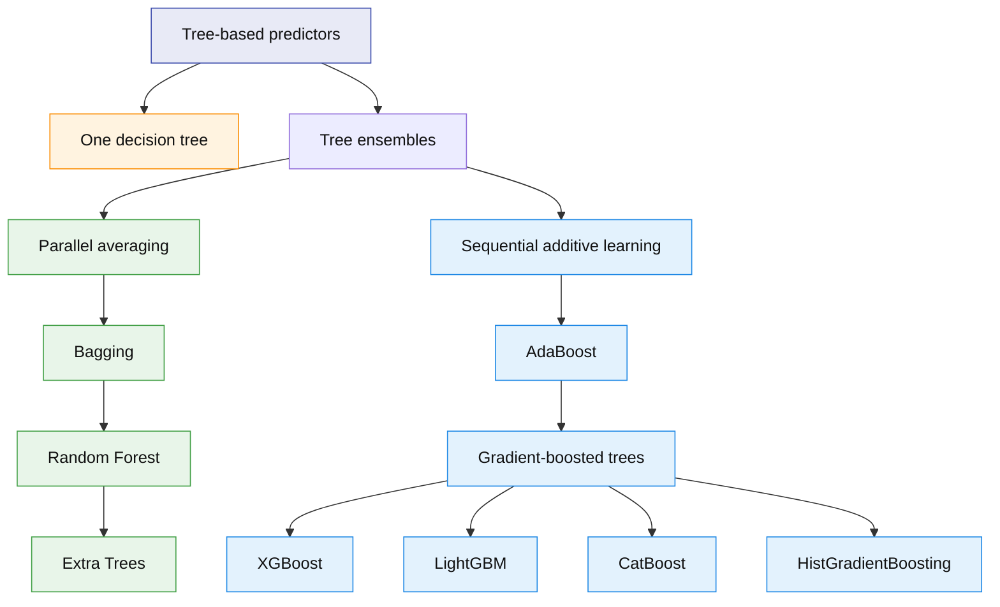

> **A practical and mathematical map of tree classifiers.** This note starts with a single CART-style decision tree, then derives bagging, Random Forests, Extra Trees, gradient boosting, and XGBoost before comparing XGBoost with LightGBM, CatBoost, and histogram gradient boosting. The emphasis is not only *which library to call*, but what objective each method optimizes, where leakage enters, and how to validate these models on grouped multimodal data.

> [!info] Scope and evidence
> Snapshot as of **2026-07-14**. Equations follow the original algorithms and official documentation. Library APIs evolve, so verify parameters against the installed version. “Best” always means *best under a declared validation design and metric*, not best on the training set.

# 0. The one-paragraph story

A decision tree recursively divides feature space into rectangular regions and gives every sample in a leaf the same prediction. It is interpretable but unstable: a small data change can alter an early split and reshape the whole tree. **Bagging** attacks this variance by averaging many trees trained on perturbed data. **Random Forest** adds feature subsampling to decorrelate those trees; **Extra Trees** adds still more split randomness. **Boosting** instead trains trees sequentially, with each new tree correcting the current ensemble. XGBoost is regularized, second-order gradient boosting with efficient split search and systems engineering; LightGBM emphasizes histogram training, leaf-wise growth, and scale; CatBoost emphasizes leakage-resistant categorical handling and ordered boosting. They are relatives, but their statistical assumptions and failure modes are not interchangeable.



# 1. The common building block: a classification tree

## 1.1 Recursive partitioning

Given features $x\in\mathbb{R}^d$ and class $y\in\{1,\dots,K\}$, a binary tree repeatedly applies a rule such as

$$
x_j \le t
$$

and sends the example left or right. After the rules define terminal regions $R_1,\dots,R_T$, a basic tree estimates the class probability in leaf $m$ as

$$
\hat p_{mk}=\frac{1}{|R_m|}\sum_{i:x_i\in R_m}\mathbb{1}(y_i=k),
\qquad
\hat y(x)=\arg\max_k \hat p_{mk}.
$$

This is a piecewise-constant function. Standard trees learn interactions automatically: a split on feature $b$ below a split on feature $a$ represents a conditional $a\times b$ interaction. They usually need no feature standardization because split order is unchanged by a monotonic rescaling.

![[99 Assets/Media/tree-classification-deep-dive/decision-tree-iris-boundaries.png]]

*A tree creates axis-aligned, piecewise-constant decision regions. Each panel uses a different pair of Iris features, which also shows why the available representation determines how complicated the boundary must become. Source: [scikit-learn decision-tree example](https://scikit-learn.org/stable/auto_examples/tree/plot_iris_dtc.html), BSD-3-Clause.*

## 1.2 How a split is chosen

For class proportions $p_1,\ldots,p_K$ in node $Q$, common impurities are

$$
H_{\text{Gini}}(Q)=1-\sum_{k=1}^{K}p_k^2,
$$

$$
H_{\text{entropy}}(Q)=-\sum_{k=1}^{K}p_k\log p_k.
$$

A candidate split $Q\rightarrow(Q_L,Q_R)$ is scored by the weighted decrease

$$
\Delta H=H(Q)-\frac{n_L}{n_Q}H(Q_L)-\frac{n_R}{n_Q}H(Q_R).
$$

The greedy algorithm chooses the largest immediate decrease. This is computationally feasible, but not a globally optimal search over all possible trees.

![[99 Assets/Media/tree-classification-deep-dive/decision-tree-iris-structure.png]]

*The corresponding learned tree exposes the recursive sequence of threshold tests, node class mixtures, and terminal predictions. Read from the root downward; every root-to-leaf path is an explicit decision rule. Source: [scikit-learn decision-tree example](https://scikit-learn.org/stable/auto_examples/tree/plot_iris_dtc.html), BSD-3-Clause.*

## 1.3 Controlling capacity

| Control | Effect when made more restrictive |
| --- | --- |
| `max_depth` | Removes high-order interactions and very local rules |
| `max_leaf_nodes` / `num_leaves` | Caps the number of terminal regions directly |
| `min_samples_leaf` | Smooths leaf estimates; especially useful for probabilities |
| `min_samples_split` | Prevents splitting small internal nodes |
| Minimum impurity/gain | Rejects weak splits |
| Cost-complexity `ccp_alpha` | Prunes leaves whose improvement does not justify complexity |

Cost-complexity pruning selects a subtree using

$$
R_\alpha(T)=R(T)+\alpha|\widetilde T|,
$$

where $R(T)$ is training leaf impurity/error and $|\widetilde T|$ is the number of terminal nodes. A deep unpruned tree has low bias and high variance; a stump has high bias and low variance.

> [!warning] A leaf frequency is not automatically a trustworthy probability
> Deep leaves can contain few observations, and greedy tree construction selected those leaves using the same data. Class probabilities may therefore be extreme or poorly calibrated even when ranking performance is good.

# 2. Why ensembles help

If $M$ estimators have equal variance $\sigma^2$ and average pairwise error correlation $\rho$, the variance of their mean is approximately

$$
\operatorname{Var}(\bar f)=\sigma^2\left(\rho+\frac{1-\rho}{M}\right).
$$

Adding trees reduces the independent component, but not the shared correlated component. This explains the Random Forest recipe:

1. make each tree reasonably strong;
2. make trees different through bootstrap rows and random feature subsets;
3. average enough of them.

Boosting works differently. It does not primarily average independent noisy replicas; it constructs an additive function in a directed optimization process.

| Family | Trees trained | Primary effect | Typical tree size |
| --- | --- | --- | --- |
| Bagging / RF / Extra Trees | Independently, then averaged | Variance reduction | Deep |
| AdaBoost | Sequentially, emphasizing mistakes | Bias reduction / margin growth | Stumps or shallow |
| Gradient boosting | Sequentially, following loss gradients | Functional optimization | Shallow to moderate |

# 3. Bagging, Random Forest, and Extra Trees

## 3.1 Bagging

For each tree $b$:

1. draw a bootstrap dataset of $n$ rows with replacement;
2. fit a high-variance tree $f_b$;
3. average class probabilities or vote.

$$
\hat p(y=k\mid x)=\frac{1}{B}\sum_{b=1}^{B}\hat p_b(y=k\mid x).
$$

Roughly 63.2% of unique training cases appear in one size-$n$ bootstrap sample. The omitted **out-of-bag (OOB)** cases can estimate generalization performance without a separate validation set, although grouped data still needs group-respecting sampling; ordinary row-level OOB evaluation does not magically prevent subject leakage.

## 3.2 Random Forest

Random Forest adds a random subset of candidate features at each split. This prevents a few dominant predictors from causing all trees to make similar decisions. Important controls are:

- number of trees: more usually stabilizes but costs time and memory;
- features considered per split: fewer decorrelates trees but can weaken them;
- minimum leaf size and depth: govern smoothing;
- row bootstrap and class/sample weights.

**Strengths:** robust default, little preprocessing, nonlinear interactions, parallel training, useful baseline on small-to-medium tabular data.

**Limits:** large forests can be memory-heavy; axis-aligned predictions do not extrapolate; native high-cardinality categories vary by implementation; impurity importance is biased; probability calibration is not guaranteed.

![[99 Assets/Media/tree-classification-deep-dive/tree-ensemble-decision-surfaces.png]]

*Decision Tree, Random Forest, Extra Trees, and AdaBoost applied to the same feature pairs. The ensemble columns reveal how averaging/randomization or sequential correction changes a single tree’s blocky partition. These are training-set visualizations for intuition—not evidence that one method universally wins. Source: [scikit-learn ensemble example](https://scikit-learn.org/stable/auto_examples/ensemble/plot_forest_iris.html), BSD-3-Clause.*

## 3.3 Extremely Randomized Trees

Extra Trees randomizes candidate thresholds rather than optimizing every threshold exactly, and common implementations use the whole dataset by default rather than bootstrap sampling. More randomness can reduce inter-tree correlation and speed fitting, at the price of additional bias. It is often worth testing beside Random Forest because it changes the bias–variance trade rather than merely changing a cosmetic parameter.

# 4. From AdaBoost to gradient boosting

## 4.1 AdaBoost

For binary labels $y_i\in\{-1,+1\}$, AdaBoost builds

$$
F_M(x)=\sum_{m=1}^{M}\alpha_m h_m(x),
$$

giving larger weight to observations misclassified by the previous ensemble. It is connected to minimizing exponential loss

$$
\sum_i \exp[-y_iF(x_i)].
$$

AdaBoost made the sequential correction idea famous, but exponential emphasis can react strongly to label noise and outliers.

## 4.2 Gradient boosting as optimization in function space

Gradient boosting chooses a differentiable loss $L(y,F(x))$. At iteration $m$, compute the negative gradient, or pseudo-residual,

$$
r_{im}=-\left[\frac{\partial L(y_i,F(x_i))}{\partial F(x_i)}\right]_{F=F_{m-1}},
$$

fit a tree $h_m$ to these values, and update

$$
F_m(x)=F_{m-1}(x)+\eta h_m(x),
$$

where $\eta$ is the learning rate. A smaller $\eta$ usually needs more rounds. Subsampling rows produces stochastic gradient boosting and can regularize the ensemble.

For binary log loss with margin $z_i=F(x_i)$ and $p_i=\sigma(z_i)$,

$$
g_i=\frac{\partial L}{\partial z_i}=p_i-y_i,
\qquad
h_i=\frac{\partial^2L}{\partial z_i^2}=p_i(1-p_i).
$$

Class prediction is thresholded probability; the learned object is fundamentally a score or margin.

# 5. XGBoost: the mathematical core

## 5.1 Additive model and regularized objective

XGBoost represents the prediction as a sum of trees:

$$
\hat y_i=\sum_{k=1}^{K}f_k(x_i),\qquad f_k\in\mathcal F.
$$

At boosting round $t$, it adds $f_t$ to minimize

$$
\mathcal L^{(t)}=\sum_i l\left(y_i,\hat y_i^{(t-1)}+f_t(x_i)\right)+\Omega(f_t),
$$

with tree regularization

$$
\Omega(f)=\gamma T+\frac{1}{2}\lambda\sum_{j=1}^{T}w_j^2.
$$

Here $T$ is the number of leaves, $w_j$ is leaf $j$’s score, $\gamma$ charges for adding a leaf, and $\lambda$ shrinks leaf scores.

## 5.2 Second-order approximation

Using a second-order Taylor expansion around the current prediction,

$$
\widetilde{\mathcal L}^{(t)}=
\sum_i\left[g_if_t(x_i)+\frac{1}{2}h_if_t(x_i)^2\right]+\Omega(f_t),
$$

where $g_i$ and $h_i$ are first and second derivatives of the loss. For leaf $j$ with instances $I_j$, define

$$
G_j=\sum_{i\in I_j}g_i,
\qquad
H_j=\sum_{i\in I_j}h_i.
$$

The optimal score for a fixed leaf is

$$
w_j^*=-\frac{G_j}{H_j+\lambda},
$$

and the optimized tree score is

$$
-\frac{1}{2}\sum_{j=1}^{T}\frac{G_j^2}{H_j+\lambda}+\gamma T.
$$

The gain from splitting one leaf into left and right children is

$$
\operatorname{Gain}=\frac{1}{2}\left[
\frac{G_L^2}{H_L+\lambda}+
\frac{G_R^2}{H_R+\lambda}-
\frac{(G_L+G_R)^2}{H_L+H_R+\lambda}
\right]-\gamma.
$$

This formula is the heart of XGBoost tree construction: a split is useful only if its reduction in the local second-order objective exceeds its complexity cost.

## 5.3 What the major XGBoost parameters mean

| Parameter | Statistical meaning | Too permissive | Too restrictive |
| --- | --- | --- | --- |
| `learning_rate` / `eta` | Shrinks each tree’s contribution | Chases noise quickly | Needs many rounds; may underfit budget |
| `max_depth` | Interaction depth / local partition complexity | Memorization | Misses interactions |
| `max_leaves` | Direct leaf-count capacity | Tiny regions | Coarse model |
| `min_child_weight` | Minimum child Hessian mass | Fragile leaves | Rejects minority/local structure |
| `gamma` | Minimum gain / leaf charge | Weak splits | Useful subtle splits removed |
| `reg_lambda` | L2 shrinkage of leaf scores | Extreme scores if too low | Over-shrunk updates |
| `reg_alpha` | L1 shrinkage of leaf scores | Dense small effects | May zero useful effects |
| `subsample` | Row sampling per round | Correlated trees | Noisy/weak rounds |
| `colsample_bytree` | Feature sampling | Dominant features repeat | Strong predictors often unavailable |

Do not transfer a tuned value blindly across objectives or datasets. For example, `min_child_weight` is Hessian mass, not literally a sample count.

# 6. Why XGBoost is fast and practical

## 6.1 Split algorithms

- **Exact:** enumerates sorted split candidates; expensive on large data.
- **Approximate:** quantile-based candidate generation.
- **Histogram (`tree_method="hist"`):** bins continuous values, accumulates gradient/Hessian histograms, and searches bins rather than every observed value. This is the normal practical starting point.

The original system also introduced a weighted quantile sketch, sparsity-aware access, cache-aware blocks, compression, sharding, and out-of-core techniques. Modern APIs add CPU, GPU, distributed, and external-memory paths; exact behavior depends on version and data interface.

## 6.2 Missing and sparse values

XGBoost can learn a **default direction** at a split for missing values rather than requiring mean imputation. That convenience does not make missingness harmless:

- “missing” can encode site, device, or acquisition failure;
- train and deployment missingness can differ;
- zero may be a real value rather than missing;
- preprocessing learned globally can still leak information.

## 6.3 Categorical features

Current XGBoost supports native categorical splits with histogram/approximate tree methods. Categories may be treated with one-hot splits or optimal partitioning. In the scikit-learn interface, use categorical dtypes plus `enable_categorical=True`; serialize to JSON/UBJSON so category metadata is preserved. Category coding must remain consistent at inference.

CatBoost remains the first comparison to run when categorical features are numerous, high-cardinality, or central to the problem.

## 6.4 Constraints and alternative boosters

- **Monotonic constraints** can force prediction to be nondecreasing or nonincreasing in selected features when domain knowledge justifies it.
- **Interaction constraints** can prevent implausible feature groups from interacting.
- **DART** drops trees during boosting to reduce over-specialization, but changes training and prediction details and is not a free default upgrade.
- `device="cuda"` with histogram training enables GPU acceleration when supported.

Constraints encode assumptions, not truth. Validate both predictive impact and whether the constrained relation is scientifically defensible.

# 7. XGBoost versus its closest relatives

## 7.1 LightGBM

LightGBM is a histogram GBDT designed for speed and memory efficiency. Its characteristic choices are:

- **leaf-wise / best-first growth:** split the current leaf with greatest loss reduction rather than growing every branch level-wise;
- **histogram subtraction:** derive one sibling histogram from its parent and the other sibling;
- **GOSS:** retain large-gradient examples and sample among small-gradient examples;
- **EFB:** bundle sparse features that are nearly mutually exclusive;
- native categorical partitioning and missing-value handling.

For a fixed number of leaves, leaf-wise growth can reduce training loss quickly, but can create a very deep branch and overfit small datasets. Treat `num_leaves`, `min_data_in_leaf`, and often `max_depth` as a connected capacity system.

| Level-wise growth | LightGBM leaf-wise growth |
| --- | --- |
| ![[99 Assets/Media/tree-classification-deep-dive/lightgbm-level-wise-growth.png]] | ![[99 Assets/Media/tree-classification-deep-dive/lightgbm-leaf-wise-growth.png]] |
| Expands the tree one level at a time. | Expands whichever current leaf yields the largest loss reduction. |

*LightGBM’s best-first strategy can spend capacity where it helps the objective most, producing an asymmetric tree. That efficiency is also why small leaves require careful control. Source: [LightGBM feature guide](https://lightgbm.readthedocs.io/en/latest/Features.html), Microsoft / LightGBM documentation.*

## 7.2 CatBoost

Naively replacing a category by its full-data target mean leaks the label. CatBoost’s **ordered target statistics** compute category information for example $i$ from examples earlier in a permutation, schematically

$$
\operatorname{CTR}_i=
\frac{\sum_{j<i,\,x_j=x_i}y_j+aP}
{\sum_{j<i,\,x_j=x_i}1+a},
$$

where $P$ is a prior and $a$ its strength. Ordered boosting similarly uses permutation-respecting predictions to reduce prediction shift.

CatBoost defaults to **symmetric (oblivious) trees**: all nodes at the same depth use the same split. A depth-$d$ tree therefore has $2^d$ leaves. This regular structure supports fast inference and acts as a structural regularizer. CatBoost is often the strongest low-friction first choice for mixed numeric/categorical tables, but it still needs group-aware validation; ordered statistics do not fix subject leakage.

## 7.3 Histogram Gradient Boosting

`HistGradientBoostingClassifier` in scikit-learn offers histogram-based boosting, missing-value support, categorical feature support, monotonic constraints, and sklearn-native pipelines without an external boosting dependency. It is an important baseline, especially when deployment simplicity matters.

## 7.4 Side-by-side mental model

| Algorithm | Main diversity/optimization mechanism | Tree growth | Categorical strategy | Good first use |
| --- | --- | --- | --- | --- |
| Decision Tree | One greedy partition | Depth-wise | Encode / implementation-specific | Explainable rule baseline |
| Random Forest | Bootstrap + random feature subsets | Independent deep trees | Usually preprocessing needed | Robust low-tuning baseline |
| Extra Trees | Random thresholds + feature subsets | Independent deep trees | Usually preprocessing needed | Faster/more randomized RF comparison |
| AdaBoost | Reweight mistakes | Shallow sequential trees | Usually preprocessing needed | Simple boosting baseline |
| Classical GBDT | First-order functional gradients | Usually depth-wise | Usually preprocessing needed | Small clean tabular data |
| XGBoost | Regularized second-order boosting | Depth-wise or loss-guided | Native support | Strong general-purpose benchmark |
| LightGBM | Histogram + systems optimizations | Leaf-wise | Native partitioning | Large, sparse, high-dimensional tables |
| CatBoost | Ordered boosting/statistics | Symmetric by default | Core design strength | Many important categorical variables |
| HistGradientBoosting | Histogram boosting | Implementation-specific | Native support | Dependency-light sklearn workflow |

# 8. Classification-specific decisions

## 8.1 Choose the metric before the model

| Goal | Useful metrics | Main caveat |
| --- | --- | --- |
| Overall correctness | Accuracy | Misleading with imbalance |
| Equal attention to classes | Macro-F1, balanced accuracy | F1 ignores true negatives and calibration |
| Ranking positives | AUROC | Can look optimistic with rare positives |
| Rare-positive retrieval | AUPRC | Depends strongly on prevalence |
| Probability quality | Log loss, Brier score | Sensitive to confidently wrong predictions |
| Operating decision | Sensitivity/specificity, cost at threshold | Threshold must be chosen without test leakage |

Report uncertainty across groups or folds, not just a single pooled number.

## 8.2 Imbalance: three different problems

Do not conflate:

1. **training emphasis** — class/sample weights or resampling;
2. **probability estimation** — calibration of predicted risk;
3. **decision policy** — threshold chosen for costs or desired recall.

For XGBoost, a common starting heuristic is

$$
\texttt{scale\_pos\_weight}\approx\frac{N_{\text{negative}}}{N_{\text{positive}}},
$$

but it is not universally optimal and can distort raw probabilities. Tune on training folds, then select a threshold and, if needed, calibrate using data independent of fitting.

## 8.3 Calibration

A reliability diagram compares predicted probability with observed frequency. Brier score and log loss summarize probabilistic quality. Sigmoid/Platt or isotonic calibration must be fit on held-out predictions—not on the same examples used to fit the trees. With grouped data, every calibration split must also keep groups disjoint.

![[99 Assets/Media/tree-classification-deep-dive/classifier-calibration-comparison.png]]

*Reliability curves compare predicted confidence with empirical frequency; the diagonal represents ideal calibration. The lower histograms show where each classifier actually emits probabilities, preventing a visually good curve over a tiny range from being overinterpreted. Source: [scikit-learn calibration comparison](https://scikit-learn.org/stable/auto_examples/calibration/plot_compare_calibration.html), BSD-3-Clause.*

# 9. Validation and leakage—especially for multimodal human data

For repeated windows, utterances, frames, or trials from the same participant, random row splitting estimates performance on **more data from known people**, not necessarily unseen-person generalization.

Use:

- `GroupKFold` when every subject must appear in exactly one test fold;
- `StratifiedGroupKFold` when feasible to preserve class balance while keeping subjects disjoint;
- nested group CV when hyperparameter selection and unbiased performance estimation both matter;
- a chronological or site-level outer split when deployment crosses time or collection sites.

All learned operations belong inside training folds:

- imputation, scaling, discretization, categorical encoding;
- feature selection and dimensionality reduction;
- window aggregation and normalization statistics;
- oversampling and class-weight selection;
- hyperparameter optimization;
- early-stopping validation selection;
- calibration and decision-threshold tuning.

> [!danger] Common multimodal leakage patterns
> - Overlapping windows from one recording appear in both train and test.
> - Face/body/voice identity lets the model recognize participants.
> - Target statistics are computed before splitting.
> - Features are normalized using each complete session, including future/test periods.
> - Multiple rows derived from the same annotated event are treated as independent.
> - Optuna or manual tuning repeatedly consults the nominal test set.

A strong thesis comparison should hold constant the outer folds, features, preprocessing, metric, and tuning budget across Random Forest, XGBoost, LightGBM, and CatBoost. Otherwise the comparison is between pipelines, not just algorithms.

# 10. A disciplined tuning strategy

## 10.1 Tune in this order

1. **Freeze the question:** target, prediction unit, group definition, outer CV, and metric.
2. **Establish baselines:** majority/dummy, logistic regression, one tree, Random Forest.
3. **Control tree capacity:** depth/leaves and minimum leaf/Hessian mass.
4. **Couple learning rate with rounds:** use many possible rounds and early stopping inside training data.
5. **Add stochasticity:** row and column subsampling.
6. **Tune shrinkage:** L1/L2 and minimum gain.
7. **Address imbalance and thresholds:** only under the chosen deployment metric.
8. **Check stability:** inspect variation by fold, subject, class, and seed.

## 10.2 Sensible XGBoost search region—not a universal recipe

```python
search_space = {
    "learning_rate": [0.03, 0.05, 0.08],
    "max_depth": [3, 4, 6],
    "min_child_weight": [1, 3, 10],
    "subsample": [0.7, 0.85, 1.0],
    "colsample_bytree": [0.7, 0.85, 1.0],
    "reg_lambda": [1, 3, 10],
    "reg_alpha": [0, 0.1, 1],
}
```

Start with `tree_method="hist"`, a generous `n_estimators` such as 2,000, and 50–100 early-stopping rounds. The correct region depends on sample size, feature count, imbalance, objective, and group structure. For small subject counts, broad hyperparameter search can itself overfit the validation folds.

# 11. End-to-end grouped XGBoost template

This template creates disjoint train, early-stopping, and final test subjects. In a publication, repeat the process across outer folds rather than reporting one split.

```python
import numpy as np
import xgboost as xgb

from sklearn.model_selection import GroupShuffleSplit
from sklearn.metrics import (
    balanced_accuracy_score,
    average_precision_score,
    log_loss,
    brier_score_loss,
)

# X: pandas DataFrame or numeric array
# y: binary labels {0, 1}
# groups: participant/session identifier

# 1) Untouched group-level test set
outer = GroupShuffleSplit(n_splits=1, test_size=0.20, random_state=42)
trainval_idx, test_idx = next(outer.split(X, y, groups))

X_trainval, X_test = X.iloc[trainval_idx], X.iloc[test_idx]
y_trainval, y_test = y[trainval_idx], y[test_idx]
g_trainval = groups[trainval_idx]

# 2) Group-level validation set used only for early stopping
inner = GroupShuffleSplit(n_splits=1, test_size=0.20, random_state=43)
train_idx, val_idx = next(inner.split(X_trainval, y_trainval, g_trainval))

X_train, X_val = X_trainval.iloc[train_idx], X_trainval.iloc[val_idx]
y_train, y_val = y_trainval[train_idx], y_trainval[val_idx]

model = xgb.XGBClassifier(
    objective="binary:logistic",
    n_estimators=2000,
    learning_rate=0.05,
    max_depth=4,
    min_child_weight=3,
    subsample=0.8,
    colsample_bytree=0.8,
    reg_lambda=3.0,
    reg_alpha=0.1,
    tree_method="hist",
    eval_metric="logloss",
    early_stopping_rounds=75,
    random_state=42,
    n_jobs=-1,
)

model.fit(
    X_train,
    y_train,
    eval_set=[(X_val, y_val)],
    verbose=False,
)

p_test = model.predict_proba(X_test)[:, 1]
y_hat = (p_test >= 0.5).astype(int)  # tune threshold on validation data if needed

print("best round:", model.best_iteration)
print("balanced accuracy:", balanced_accuracy_score(y_test, y_hat))
print("AUPRC:", average_precision_score(y_test, p_test))
print("log loss:", log_loss(y_test, p_test))
print("Brier:", brier_score_loss(y_test, p_test))
```

For native categorical variables:

```python
cat_cols = ["task", "site", "device"]
X[cat_cols] = X[cat_cols].astype("category")

model = xgb.XGBClassifier(
    tree_method="hist",
    enable_categorical=True,
    # ...remaining parameters...
)

model.fit(X_train, y_train, eval_set=[(X_val, y_val)], verbose=False)
model.save_model("xgboost_model.json")  # preserves categorical metadata
```

Ensure category dtype and levels are consistent *before* creating split subsets. For preprocessing that learns statistics, use a pipeline or fit each transformer only on the training portion.

# 12. Fair model-comparison skeleton

```python
from sklearn.ensemble import (
    RandomForestClassifier,
    ExtraTreesClassifier,
    HistGradientBoostingClassifier,
)

models = {
    "random_forest": RandomForestClassifier(
        n_estimators=500,
        min_samples_leaf=5,
        class_weight="balanced",
        n_jobs=-1,
        random_state=42,
    ),
    "extra_trees": ExtraTreesClassifier(
        n_estimators=500,
        min_samples_leaf=5,
        class_weight="balanced",
        n_jobs=-1,
        random_state=42,
    ),
    "hist_gbdt": HistGradientBoostingClassifier(
        learning_rate=0.05,
        max_leaf_nodes=31,
        min_samples_leaf=20,
        random_state=42,
    ),
}
```

Use exactly the same outer group folds for every model. Inner tuning folds may be shared too. Compare distributions of outer-fold scores and per-subject errors, not only the winning mean.

# 13. Interpretation without fooling yourself

## 13.1 Feature importance methods

| Method | Answers | Major trap |
| --- | --- | --- |
| Split count / gain | What the fitted trees used | Favors variables with many possible splits; not causal |
| Permutation importance | How much held-out performance falls when a feature is disrupted | Correlated substitutes hide each other; permutation may create impossible samples |
| TreeSHAP | How features distribute a prediction relative to a baseline | Depends on background/feature-dependence assumptions |
| PDP | Average predicted response as one feature varies | Extrapolates into sparse combinations under correlation |
| ICE | Per-example response curves | Many curves; still conditional-support issues |
| ALE | Local accumulated effects | Less intuitive; needs sufficient local data |

Compute permutation importance and explanatory plots on held-out group folds. Aggregate SHAP values across folds only after aligning the reference scale and feature definitions. A high importance means *predictively used by this model in this dataset*—not that the feature causes the outcome.

## 13.2 Sanity checks

- Train after shuffling labels within the valid exchangeability unit; performance should collapse.
- Remove IDs, timestamps, acquisition metadata, and post-outcome features.
- Compare group-aware and random row splits; a large gap is diagnostic.
- Examine performance after removing one modality at a time.
- Inspect worst subjects and sites, not only average SHAP summaries.
- Test multiple seeds for small datasets.

# 14. Failure modes shared by tree classifiers

1. **No smooth extrapolation:** beyond observed feature ranges, a tree stays at a terminal value.
2. **Axis-aligned inefficiency:** an oblique boundary may require many rectangular leaves.
3. **High-cardinality memorization:** IDs and rare categories can become shortcuts.
4. **Dataset shift:** missingness, category levels, prevalence, devices, or populations change.
5. **Overconfident probabilities:** ranking can be strong while calibration is poor.
6. **Correlated-feature ambiguity:** importance may move among interchangeable predictors.
7. **Small-group instability:** a few participants can determine splits and hyperparameters.
8. **Leakage through feature engineering:** a powerful learner efficiently exploits tiny leaks.
9. **Compute mistaken for evidence:** exhaustive tuning does not compensate for weak sample independence.

# 15. Algorithm selection cheat sheet

| Situation | Start with | Also test | Reason |
| --- | --- | --- | --- |
| Need a human-readable rule | Pruned decision tree | Rule list / logistic regression | One inspectable model |
| Small-to-medium numeric table | Random Forest | Extra Trees, XGBoost | Stable baseline before boosting |
| Strong tabular accuracy target | XGBoost | LightGBM, CatBoost | Regularized boosting benchmark |
| Many categorical features | CatBoost | LightGBM, native XGBoost | Ordered categorical handling |
| Very large or sparse table | LightGBM | XGBoost histogram | Histogram and sparse optimizations |
| sklearn-only deployment | HistGradientBoosting | RF / Extra Trees | Simple dependency surface |
| Very rare positive class | Weighted XGBoost or balanced RF | CatBoost / LightGBM | But validate AUPRC, calibration, threshold |
| Unseen-subject multimodal study | Group-CV RF baseline | Group-CV boosted trees | Validation design dominates brand |
| Known directional relationships | Constrained XGBoost/LightGBM | Interpretable generalized model | Encode justified monotonicity |

**Default research sequence:** Dummy → logistic regression → Random Forest → XGBoost → CatBoost if categories matter → LightGBM if scale matters. Stop when added complexity does not survive outer-fold uncertainty.

# 16. Related vault notes

- [[02 Research/Thesis Reading List — Self-Adaptors & Discourse-Planning Difficulty/ADABase A Multimodal Dataset for Cognitive Load Estimation]] — uses XGBoost classifiers and a regressor for multimodal cognitive-load estimation.
- [[02 Research/Thesis Reading List — Self-Adaptors & Discourse-Planning Difficulty/Multi-Source Domain Generalization for ECG-Based Cognitive Load Estimation A Plug-in Method and Benchmark]] — includes a LightGBM baseline under domain generalization.
- [[02 Research/Thesis Reading List — Self-Adaptors & Discourse-Planning Difficulty/Predictability of Understanding in Explanatory Interactions Based on Multimodal Cues]] — compares against Random Forest in an interaction-understanding setting.
- [[02 Research/Thesis Reading List — Self-Adaptors & Discourse-Planning Difficulty/Evaluating the Robustness of Multimodal Task Load Estimation Models]] — particularly relevant for subject-wise nested CV, tuning, and calibration.
- [[02 Research/Thesis Reading List — Self-Adaptors & Discourse-Planning Difficulty/Automatic Detection of Self-Adaptors for Psychological Distress/Automatic Detection of Self-Adaptors for Psychological Distress]] — uses Random Forest for feature selection in behavioral signal analysis.

# 17. Primary sources and official references

## Foundational papers

- Chen, T. & Guestrin, C. (2016), [XGBoost: A Scalable Tree Boosting System](https://arxiv.org/abs/1603.02754).
- Friedman, J. H. (2001), [Greedy Function Approximation: A Gradient Boosting Machine](https://doi.org/10.1214/aos/1013203451).
- Breiman, L. (2001), [Random Forests](https://doi.org/10.1023/A:1010933404324).
- Geurts, P., Ernst, D. & Wehenkel, L. (2006), [Extremely Randomized Trees](https://doi.org/10.1007/s10994-006-6226-1).
- Freund, Y. & Schapire, R. E. (1997), [A Decision-Theoretic Generalization of On-Line Learning and an Application to Boosting](https://doi.org/10.1006/jcss.1997.1504).
- Ke, G. et al. (2017), [LightGBM: A Highly Efficient Gradient Boosting Decision Tree](https://proceedings.neurips.cc/paper_files/paper/2017/hash/6449f44a102fde848669bdd9eb6b76fa-Abstract.html).
- Prokhorenkova, L. et al. (2018), [CatBoost: Unbiased Boosting with Categorical Features](https://arxiv.org/abs/1706.09516).

## Official implementation documentation

- [XGBoost: Introduction to Boosted Trees](https://xgboost.readthedocs.io/en/stable/tutorials/model.html) — objective, second-order approximation, leaf weights, and split gain.
- [XGBoost parameters](https://xgboost.readthedocs.io/en/stable/parameter.html) — current parameter semantics.
- [XGBoost categorical data](https://xgboost.readthedocs.io/en/stable/tutorials/categorical.html) — native categories and model serialization.
- [XGBoost monotonic constraints](https://xgboost.readthedocs.io/en/stable/tutorials/monotonic.html).
- [LightGBM features](https://lightgbm.readthedocs.io/en/latest/Features.html) — histograms, leaf-wise growth, and categorical splits.
- [CatBoost ordered boosting and categorical transformation](https://catboost.ai/docs/en/concepts/algorithm-main-stages_fighting-biases).
- [CatBoost parameter tuning and tree-growing policies](https://catboost.ai/docs/en/concepts/parameter-tuning).
- [scikit-learn decision trees](https://scikit-learn.org/stable/modules/tree.html) and [ensemble methods](https://scikit-learn.org/stable/modules/ensemble.html).
- [scikit-learn grouped cross-validation](https://scikit-learn.org/stable/modules/cross_validation.html#cross-validation-iterators-for-grouped-data) and [probability calibration](https://scikit-learn.org/stable/modules/calibration.html).

# 18. Final takeaway

XGBoost is not “a smarter decision tree.” It is a regularized additive model whose trees are chosen using gradients, Hessians, split-gain penalties, shrinkage, and sampling. Random Forest reduces the variance of largely independent trees; LightGBM changes the construction strategy for scale; CatBoost changes how categorical information and sequential bias are handled. The practical winner depends less on leaderboard reputation than on leakage-free validation, an appropriate metric, probability/threshold requirements, and the structure of the data. For repeated human or multimodal observations, **getting the group boundary right is more important than choosing among the three boosting libraries**.
